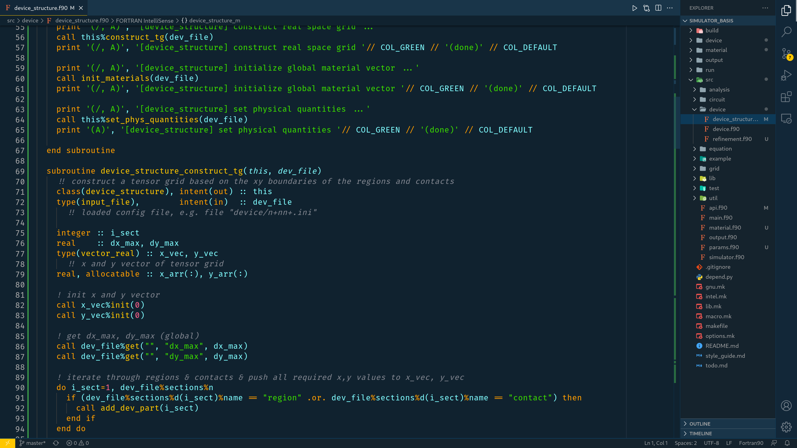

# Cobalt3Dark Theme for VS Code

This is just a darker version of the common Cobalt3 theme. Enjoy!



## Installation
1. Open the Extensions sidebar panel from within the Visual Studio Code editor window.
2. Search for the theme in the extension marketplace search and then click the Install button.
3. Enable the installed theme from the Color Theme drop down list.
4. Optional: Use the recommended settings below for best experience
## Recommended Settings
I highly recommend using the Material icon theme and the FiraCode font in combination with the Coblat3Dark theme. You should modify your settings.json as follows:
```json
{
    // Themes
  "workbench.colorTheme": "Cobalt3Dark",
  "workbench.iconTheme":  "material-icon-theme",
  "workbench.editor.limit.enabled": true,

  // Editor
  "editor.fontFamily": "Fira Code",
  "editor.fontLigatures": true,
  "editor.fontSize": 17,
  "editor.lineHeight": 23,
  "editor.letterSpacing": 0.1,
  "editor.fontWeight": "450", // Retina
  "diffEditor.ignoreTrimWhitespace": false,

  // Editor: cursor
  "editor.cursorStyle": "line",
  "editor.cursorWidth": 2,
  "editor.cursorBlinking": "phase",
  "editor.cursorSmoothCaretAnimation": true,
  "editor.smoothScrolling": true,

  // Editor: minimap
  "editor.minimap.enabled": true,
  "editor.minimap.renderCharacters": false,
  "editor.minimap.maxColumn": 200,
  "editor.minimap.showSlider": "always",

  // Workbench
  "workbench.sideBar.location": "right",

  // Terminal
  "terminal.integrated.cursorWidth": 2,
  "terminal.integrated.cursorStyle": "line",
  "terminal.integrated.cursorBlinking": true,
  "terminal.integrated.copyOnSelection": true,

  // Files
  "files.autoSave": "afterDelay",
  "files.insertFinalNewline": true,
  "files.trimTrailingWhitespace": true,

  "window.zoomLevel": 1
}
```


